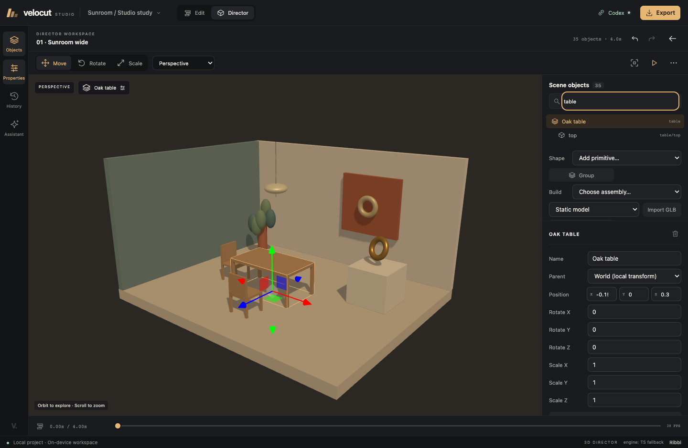
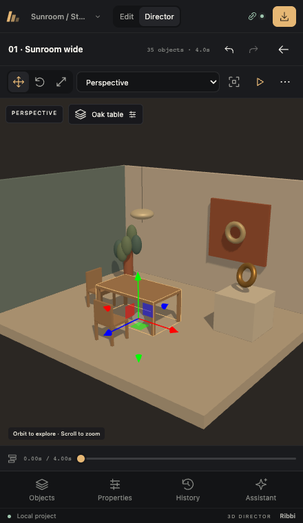
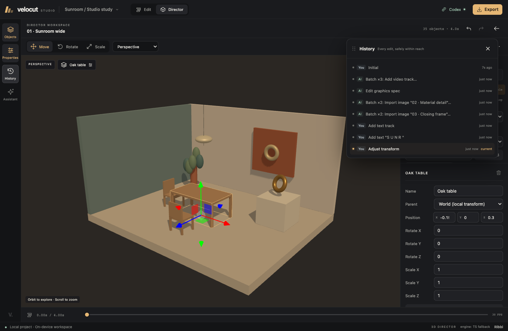

**English** · [简体中文](README.zh-CN.md)

# Velocut

**A browser studio for editing video and directing 3D scenes with AI.**

[](https://github.com/open-ribbi/velocut/releases/tag/v0.0.1)
[](https://github.com/open-ribbi/velocut/actions/workflows/ci.yml)
[](https://github.com/open-ribbi/velocut/actions/workflows/distribution.yml)
[](LICENSE)

**[Download 0.0.1](https://github.com/open-ribbi/velocut/releases/tag/v0.0.1)** · [Connect Codex](#connect-codex) · [Use the SDKs](#use-the-sdks) · [Contribute](CONTRIBUTING.md)

Velocut combines a multitrack video editor, an editable 3D Director and a programmable project runtime. Arrange a shot by hand or ask Codex to build it: both use the same editing services, project document and undo history.

Built by [Ribbi](https://ribbi.ai). Media storage and rendering stay in your browser. AI observations and optional cloud features send the data needed by the model or provider you choose.


*The current Studio UI, captured from a real project. The demo scene is made from editable geometry and furniture assemblies.*

## Start Studio

Download the **[portable ZIP](https://github.com/open-ribbi/velocut/releases/download/v0.0.1/velocut-standalone.zip)** or **[TAR.GZ](https://github.com/open-ribbi/velocut/releases/download/v0.0.1/velocut-standalone.tar.gz)**, extract it, then run inside the `velocut-0.0.1` directory:

```sh
node start-studio.mjs
```

Studio opens in your browser. Keep the terminal running while you work. The portable bundle includes the editor, scene assets and a Codex plugin marketplace; no source checkout or `npm install` is required.

- **Node.js 22.6+** and **Chrome/Edge with WebGPU and WebCodecs** are required. Safari and Firefox are not currently supported by the full editor.
- Projects live in browser IndexedDB/OPFS. Reuse the same browser profile, hostname and port to reopen them.
- Manual editing and the Codex integration need no additional model API key.
- The release includes [SHA-256 checksums](https://github.com/open-ribbi/velocut/releases/download/v0.0.1/SHA256SUMS.txt). Public npm registry publication is still pending; the release provides installable `.tgz` packages today.

## Connect Codex

1. Start Studio using the portable launcher.
2. Add the extracted release directory as a local marketplace source in Codex and install **Velocut**.
3. Start a new Codex task and ask it to connect to the Studio URL printed in your terminal.
4. Open the returned pairing link. Codex can then select your project, edit it and inspect rendered views.

Try a request such as:

> Build a sunlit room with a wooden table, two chairs and a small sculpture. Keep everything editable, then compose a wide shot and a close-up.

The model runs in Codex. The plugin supplies tools for scene creation, object editing, GLB import, arrangement, camera control and visual inspection. It does not call a second LLM inside Velocut. Other MCP clients can use the same generic MCP server.

[Connection and troubleshooting guide →](docs/integrations/codex-plugin.md)

## Build scenes in the Director

Create primitives, editable meshes and parametric tables, chairs or stairs. Import self-contained GLB models, adjust materials and lighting, pose characters, and direct camera shots. Transform gizmos, object properties and programmatic edits all work on the same scene data.




Static GLB export is available in the current source build through the Director, SDK and MCP. See the [model export guide](docs/integrations/model-export.md); it is not part of the existing 0.0.1 download.

### Keep the canvas usable in a small window

The workspace adapts to narrow browser panels alongside Codex. Bottom navigation opens the media/objects, properties, history and assistant panels as needed; the timeline can collapse to make room for the canvas. Media can be inserted by clicking, without dragging.

<p align="center">
  
</p>

### See what changed, then undo it

Edits are attributed in the branching history. Inspect a change, undo it, or return to an earlier state and continue from there. Revision checks reject stale AI edits when someone else has changed the scene.



*These screenshots use a reproducible documentation fixture driven through the real MCP bridge. No generated UI mockups or fabricated chat transcripts are shown.*

## What you can do

| Area | Capabilities |
| --- | --- |
| Video editing | Multiple tracks, split/trim, snapping, speed changes, track controls and transitions |
| Titles and motion | Editable text, captions, transform keyframes, effects and declarative motion graphics |
| 3D directing | Geometry, assemblies, GLB models, characters, materials, lights, physics and cameras |
| Audio | Mixed playback, volume keyframes and optional transcription/narration providers |
| AI inspection | Rendered views, frame grabs, contact sheets, shot analysis and audio metrics; available tools depend on the host integration |
| Export | WebCodecs encoding and MP4 muxing, with codec availability determined by the browser |
| Local projects | Per-project storage, persisted history and same-origin multi-tab synchronization |

The built-in **Assistant** is a separate, optional integration. Configure an Anthropic-compatible provider there to use it. Browser-local Whisper/VITS and cloud generation services have their own dependencies or credentials; they are not required for editing or Codex. Development-only cloud relays are not included in the portable server. See the [security and data-flow notes](SECURITY.md).

## Use the SDKs

The editor and its integrations share a monorepo. Seven independently packaged modules ship as JavaScript and, for the SDKs, TypeScript declarations. GPU rendering remains a browser capability; an npm package does not imply a headless Node renderer.

| Package | Purpose |
| --- | --- |
| [`@velocut/protocol`](web/packages/protocol) | Document types, commands, validation and protocol compatibility |
| [`@velocut/core-ts`](web/packages/core-ts) | Pure timeline editing, evaluation and engine history |
| [`@velocut/render-sdk`](web/packages/render-sdk) | WebGPU composition, media workers, audio and export; includes a Vite helper |
| [`@velocut/scene-sdk`](web/packages/scene-sdk) | Scene descriptions, geometry, models, physics, cameras and assets |
| [`@velocut/runtime`](web/packages/runtime) | Shared project authoring, branching history and host interfaces |
| [`@velocut/mcp`](web/packages/mcp) | Generic MCP server used by the Codex plugin and other clients |
| [`@velocut/cli`](web/packages/cli) | Prebuilt local Studio launcher |

The `.tgz` files are available in [Release 0.0.1](https://github.com/open-ribbi/velocut/releases/tag/v0.0.1). Until registry publication, install dependent Velocut tarballs together rather than using registry-only `npx` commands.

[SDK integration examples and release workflow →](docs/integrations/npm-packages.md)

## Develop from source

```sh
git clone https://github.com/open-ribbi/velocut.git
cd velocut/web
npm ci
npm run dev
```

The dev command builds the workspace SDKs first. The TypeScript engine works without Rust; the canonical Rust engine is optional and shares behavioral test vectors with it.

<details>
<summary>Build the optional Rust/WASM engine</summary>

Run from the repository root:

```sh
rustup target add wasm32-unknown-unknown
cargo install wasm-pack
wasm-pack build crates/velocut-wasm --target web --release \
  --out-dir ../../web/apps/editor/public/wasm
```

Restart the dev server. The status bar identifies the active engine. Portable builds use the TS engine by default; set `VELOCUT_INCLUDE_WASM=1` during the release build to include freshly built WASM artifacts.

</details>

```text
crates/                 Rust engine and WASM bindings
protocol/vectors/       Shared behavioral tests
web/apps/editor/        Studio UI and application wiring
web/packages/           SDKs, runtime, MCP and CLI
plugins/codex/velocut/   Codex manifest and Director skill
web/scripts/            Builds, packaging, verification and documentation capture
```

## Verify and contribute

```sh
# From web/
npm test
npm run e2e
npm run build:release
npm -w @velocut/cli test
npm run pack:release
npm run test:distribution
```

Run `cargo test` from the repository root for the Rust engine. Run build and browser checks sequentially: rebuilding SDKs can reload an active development page.

CI checks both engines, WASM compilation and editor journeys. The distribution workflow installs tarballs outside the checkout and verifies the CLI, MCP, workers and actual rendering on macOS, Windows and Linux.

[Contributing](CONTRIBUTING.md) · [Architecture](ARCHITECTURE.md) · [Command protocol](PROTOCOL.md) · [Security](SECURITY.md)

## License

MIT © 2026 willbean. Bundled third-party code and scene assets retain their own [licenses and attribution](web/packages/scene-sdk/assets/LICENSES.md).
