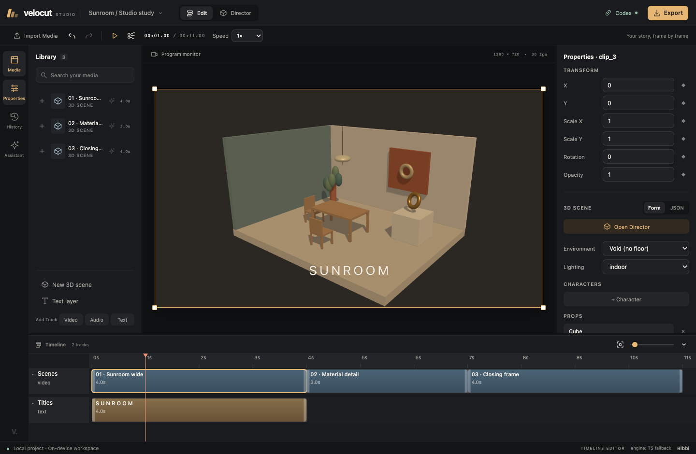
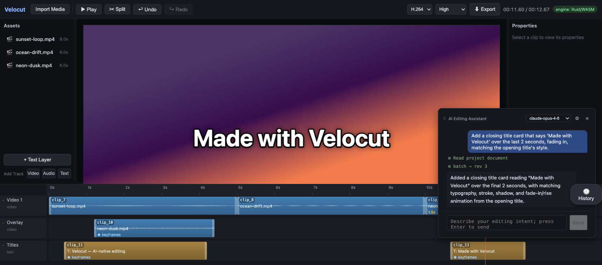

<!-- markdownlint-disable MD041 -->
**English** | [简体中文](README.zh-CN.md)

# Velocut — AI-native video editing in the browser

[](.github/workflows/ci.yml)
[](LICENSE)


Velocut, by [Ribbi](https://ribbi.ai), is an **AI-native, local-first video editor that runs entirely in the browser** — no install, no upload, media storage and rendering stay on your machine; AI observations and optional cloud features send the data needed by the selected provider. A canonical Rust engine (compiled to WASM) is mirrored by a TypeScript reference engine and kept in lock-step by shared golden-vector tests; WebGPU handles compositing and WebCodecs handles decode/export; and an LLM agent edits through the *exact same* JSON command protocol a human drives from the UI.

> **Protocol-first, AI-native.** Humans edit via the UI, the LLM issues JSON commands directly — both flow through one command pipeline into one document model. The AI agent is treated as the system's first-class *user*; the human UI's job is to make the agent's perception and actions visible and correctable.



## Requirements

- **Node ≥ 22.6** (`npm test` uses `--experimental-strip-types`; a `.nvmrc` is at the repo root)
- **Browser: Chrome / Edge 113+** (WebGPU + WebCodecs; Safari/Firefox not yet supported)
- Optional: Rust stable + `wasm-pack` (only to build the canonical WASM engine)

## Run Studio

The repository now builds two end-user distributions: a portable Studio + Codex
plugin bundle and npm packages. Registry publication is a separate maintainer
step; do not assume a version has been published just because it builds here.

**Portable release:** extract `velocut-<version>` and run:

```sh
node start-studio.mjs
```

This serves the prebuilt editor and opens your browser. No npm install or source
checkout is required. Keep the terminal running and reuse the printed hostname
and port: browser projects are scoped to that origin.

**npm, after the requested version is published:**

```sh
npx @velocut/cli@0.0.1 studio
```

**From source:**

```sh
git clone https://github.com/open-ribbi/velocut.git
cd velocut/web
npm ci
npm run dev
```

The dev command builds workspace SDKs first. The editor uses the TS reference
engine if the optional Rust/WASM bundle is absent. The status bar shows the
active engine. Chrome/Edge and Node.js 22.6+ are required; no model key is needed
for manual editing or the Codex plugin.

## Use with Codex or another MCP client

The portable release directory is also a local Codex plugin marketplace. Add
that directory as a marketplace source, install **Velocut**, then start a new
Codex task. Ask Codex to connect to the running Studio URL. It returns a pairing
link; open it and let Codex select the intended project session.

Other MCP clients can start the published `@velocut/mcp` package through `npx`
(or its installed `velocut-mcp` executable). The same MCP source is bundled in
the Codex plugin together with its Director skill. Reasoning runs in your
client's model; the editor owns rendering, state, conflicts and undo.

Detailed setup and local tarball installation: [Codex/MCP integration](docs/integrations/codex-plugin.md).
SDK use and release process: [npm distribution](docs/integrations/npm-packages.md).

## Enable the Rust/WASM engine (canonical implementation)

```bash
# one-time setup
rustup target add wasm32-unknown-unknown
cargo install wasm-pack

# build and drop into the app's public dir (or: just build-wasm)
wasm-pack build crates/velocut-wasm --target web --release \
  --out-dir web/apps/editor/public/wasm

cd web && npm run dev   # badge switches to "engine: Rust/WASM"
```

Portable releases use the TS engine by default for reproducibility. To include
freshly compiled Rust/WASM artifacts, set `VELOCUT_INCLUDE_WASM=1` when running
`npm run build:release`. Release builds copy only declared application/SDK
assets; local videos in the development public directory are excluded.

## Agent quick start

Velocut's first "user" is the AI agent. Click **Assistant** in the workspace navigation, configure a provider in the settings panel (your own Anthropic API key works as-is), and edit in natural language — *"cut out the silent parts", "add a title at the start"*.



- **The key lives only in your browser's localStorage; requests go straight from the browser to the configured endpoint with no intermediary server** (trust model: [SECURITY.md](SECURITY.md)).
- The agent can *see* (frame grabs / contact sheets), *hear* (loudness & silence analysis), and *cut* (shot-boundary detection). Every edit uses the same command protocol as the UI, so each step is visible in a chat card and the branching history tree — click to jump, undo to roll back.
- **Relays/gateways are first-class**: the ⚙ provider settings take any Anthropic-protocol-compatible base URL (LiteLLM, one-api, a corporate proxy), a choice of `x-api-key` or `Authorization: Bearer` auth, custom model ids, and a one-click connection test. The endpoint must allow browser (CORS) requests.

### Optional capabilities & key convention (dev server only)

Web search (Gemini grounding) and MiniMax cloud TTS are proxied by the Vite dev server, which injects the secrets server-side so the browser never holds them:

```bash
# both optional; the files are gitignored, placed under web/apps/editor/
echo "<your Google API key>"  > web/apps/editor/.google-key    # velocut_search
echo "<your MiniMax key>"     > web/apps/editor/.minimax-key   # cloud TTS (local TTS needs no key)
```

Note: these proxies exist only under `npm run dev`; after a static `vite build`, search and cloud TTS are unavailable.

## Testing (both engines share golden vectors)

```bash
cargo test                # the Rust engine runs protocol/vectors/*.json
cd web && npm test        # the TS engine runs the same vectors + unit tests
cd web && npm run e2e     # Playwright smoke (boot / import / edit / persistence)
```

Any change to engine behavior must land as a new vector, and both sides must pass to count as consistent. Beyond the vectors, the suite covers the agent tool-use loop (via an injected transport), the effect/motion-spec registries, and browser journeys covering editing, native 3D authoring, GLB import, MCP and compact layouts. CI (`.github/workflows/ci.yml`) checks Rust (fmt + clippy + vectors), TS (vectors + unit tests + tsc), a WASM compile smoke test, and the E2E suite. A separate distribution workflow installs real tarballs and checks the prebuilt CLI, SDK workers, GPU pixels and MCP on a macOS/Windows/Linux matrix. See [CONTRIBUTING.md](CONTRIBUTING.md) for the flow.

## Repository layout

```
crates/
  velocut-core/        # canonical engine: model / commands / eval / history (pure Rust, no wasm deps)
  velocut-wasm/        # wasm-bindgen bindings (string-JSON ABI)
protocol/
  vectors/             # golden test vectors — the behavioral contract for both engines
web/
  packages/protocol/   # TS protocol types + zod validation (1:1 shape with the Rust serde model)
  packages/core-ts/    # TS reference engine (frontend fallback; runnable on Node)
  packages/render-sdk/ # WebGPU compositing / WebCodecs decode+export / workers / perception (grabs, shots, loudness)
  packages/agent-sdk/  # Anthropic-protocol tool-use loop (injectable transport)
  packages/scene-sdk/  # editable 3D scenes, geometry, models, physics, cameras, assets
  packages/runtime/    # shared project authoring, history and host interface
  packages/mcp/        # generic MCP server; npm executable + bundled plugin runtime
  packages/cli/        # prebuilt local Studio launcher
  packages/collab-sdk/ # local-first persistence + multi-tab CRDT sync (Yjs)
  apps/editor/         # Vite + React editor (timeline / Director / compact panels)
plugins/codex/velocut/ # Codex manifest and Director skill; no duplicated editor engine
```

## Current capabilities

1. ✅ Multi-track editing: split / drag / snap / speed / trim / track reorder, with a **branching** edit history (go back and edit to fork a new branch; human vs. AI actions are color-attributed).
2. ✅ Keyframe animation (linear / hold / bezier) + an effect registry (color grade, etc.) + transitions.
3. ✅ Text layers & caption styling (rasterized → composited through the same WebGPU pipeline as video).
4. ✅ Audio: mixed playback, volume keyframes (fade-in/out, ducking), TTS narration (local / MiniMax), Whisper auto-captions.
5. ✅ Agent perception: frame-grab observation / shot-boundary detection / loudness & silence analysis, surfaced as images and sparklines in chat.
6. ✅ Declarative motion graphics (`motionClip`): keyframed layers described by a JSON spec — persisted, and safe to author from the sandboxed script tool.
7. ✅ Export: WebCodecs encode + mp4 mux (streaming, no whole-clip memory bloat); background low-res proxy transcode for smooth preview.
8. ✅ Local-first: media in OPFS, document + history in IndexedDB, real-time multi-tab sync.
9. ✅ Multi-project management: a toolbar project switcher with fully isolated per-project storage (document, history, media, caches).

Keys: Space = play / S = split / Delete = delete / Cmd+Z = undo / Ctrl+wheel = zoom timeline / drag a clip edge to trim / right-click a track head or clip for a menu.

## Programmatic entry points

- DevTools / external scripts: `window.velocut.apply({type:'splitClip', clipId:'clip_2', atUs:1500000})`
- Node-side engine: `@velocut/core-ts` (consumed inside the workspace; ships as an independently installable ESM/type-declaration package).

Command protocol → [PROTOCOL.md](PROTOCOL.md). Architecture decisions → [ARCHITECTURE.md](ARCHITECTURE.md). Security & trust model → [SECURITY.md](SECURITY.md).

## License

MIT © 2026 willbean
